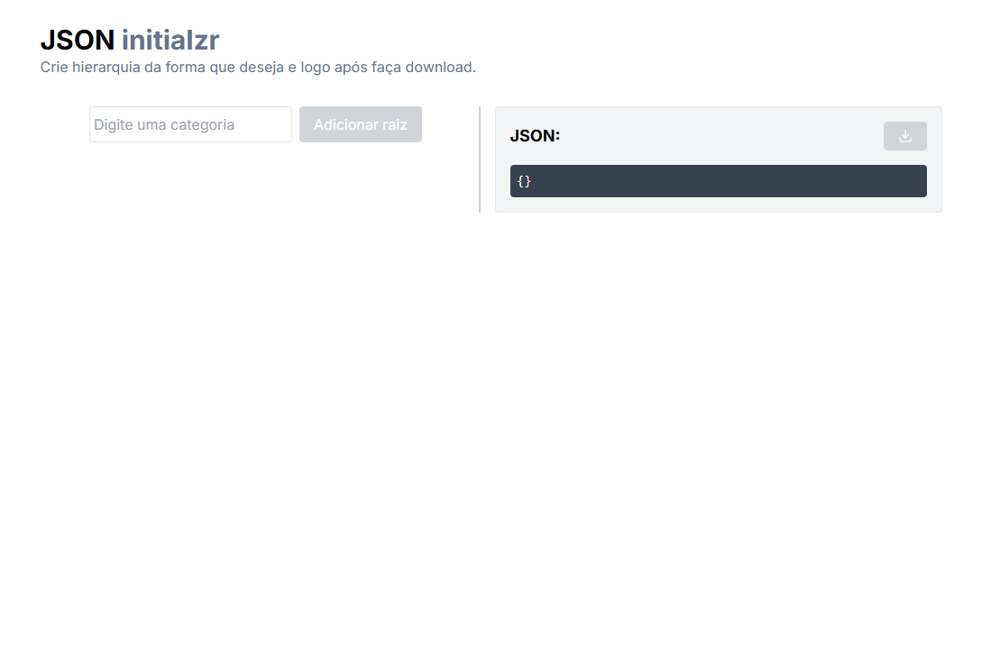
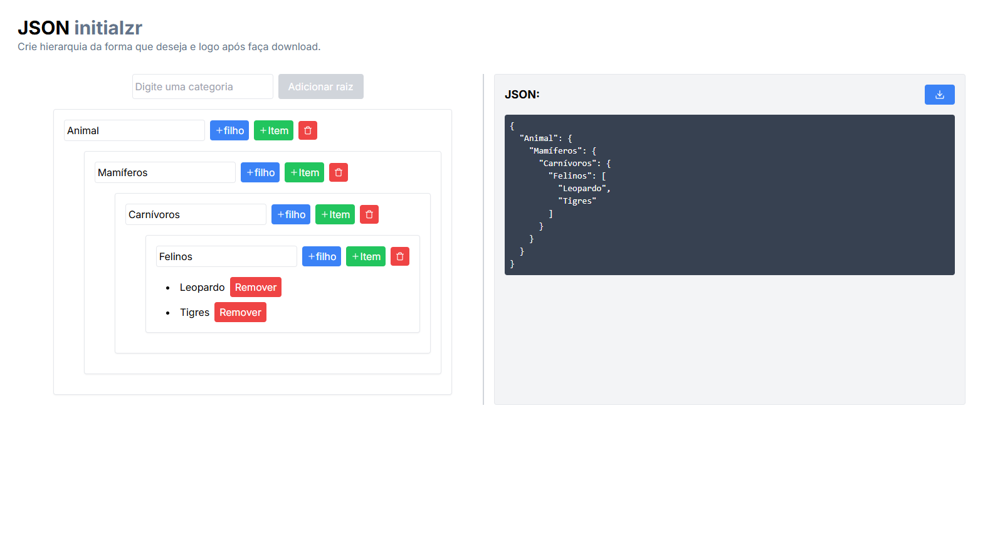

# Gerador de Hierarquia de Palavras (JSON initialzr)

Este é um projeto de interface web desenvolvido com React, TypeScript, Tailwind CSS e Next.js, que permite ao usuário criar uma hierarquia de palavras. A aplicação permite a criação de múltiplos níveis de hierarquia, bem como o download da estrutura em formato JSON.

## Funcionalidades

- **Adicionar Nós**: Permite ao usuário adicionar nós à hierarquia. Pode-se adicionar tanto objetos (com subcategorias) quanto arrays (com listas de valores).
- **Remover Nós e Valores**: O usuário pode remover qualquer nó ou valor específico da hierarquia.
- **Salvar Hierarquia como JSON**: O usuário pode salvar a hierarquia construída como um arquivo JSON, que pode ser baixado.

## Tecnologias Utilizadas

- **React**
- **TypeScript**
- **Tailwind CSS**
- **Next.js**

## Estrutura do Projeto

- `components/HierarchyNode.tsx`: Componente para criar e gerenciar nós na hierarquia.
- `components/HierarchyBuilder.tsx`: Componente principal que gerencia toda a lógica de construção da hierarquia.
- `types/HierarchyNode.ts`: Arquivo de definição de tipos para garantir que o código seja fortemente tipado.

## Instalação e Execução

1. **Clone o repositório:**

   ```bash
   git clone https://github.com/seu-usuario/gerador-json.git
   cd gerador-json
   ```

2. **Instale as dependências:**

   ```bash
   npm install
   ```

3. **Execute a aplicação:**

   ```bash
   npm run dev
   ```

## Como Usar

1. Adicionar Nó Raiz: Clique no botão "Adicionar Nó Raiz" para iniciar uma nova hierarquia.
2. Adicionar Subcategorias ou Listas: Para cada nó, você pode adicionar subcategorias (como objetos) ou listas de valores.
3. Remover Nós ou Valores: Use os botões de remoção para deletar nós ou valores específicos.
4. Salvar como JSON: Quando estiver satisfeito com a hierarquia, clique em "Salvar como JSON" para baixar a estrutura como um arquivo JSON.

## Exemplo de Hierarquia Gerada

```json
{
  "Animais": {
    "Mamíferos": {
      "Carnívoros": {
        "Felinos": ["Leões", "Tigres", "Jaguars", "Leopardos"]
      },
      "Herbívoros": {
        "Equídeos": ["Cavalos", "Zebras", "Asnos"],
        "Bovídeos": ["Bois", "Búfalos", "Antílopes", "Cabras"]
      },
      "Primatas": ["Gorilas", "Chimpanzés", "Orangotangos"]
    },
    "Aves": {
      "Rapinas": ["Águias", "Falcões", "Corujas", "Milhafres"],
      "Pássaros": ["Canários", "Papagaios", "Pardais", "Rouxinóis"]
    }
  }
}
```
## Interface do projeto




## Fluxo de Branches

Este projeto utiliza duas branches principais: `develop` e `production`.

### `develop`

- A branch `develop` é a branch principal do projeto.
- Ela sempre contém a principal do código que pode ir à produção.
- Nenhuma mudança deve ser feita diretamente na `develop`.

### `production`

- A branch `production` é usada para o desenvolvimento ativo.
- Todas as novas funcionalidades, correções de bugs ou melhorias devem ser desenvolvidas em branches individuais baseadas na `production`.
- Após o desenvolvimento e testes completos, essas branches devem ser mescladas de volta na `production`.
- Depois que várias features e correções de bugs foram integradas e testadas na `production`, uma nova versão principal pode ser mesclada para a `develop`.
